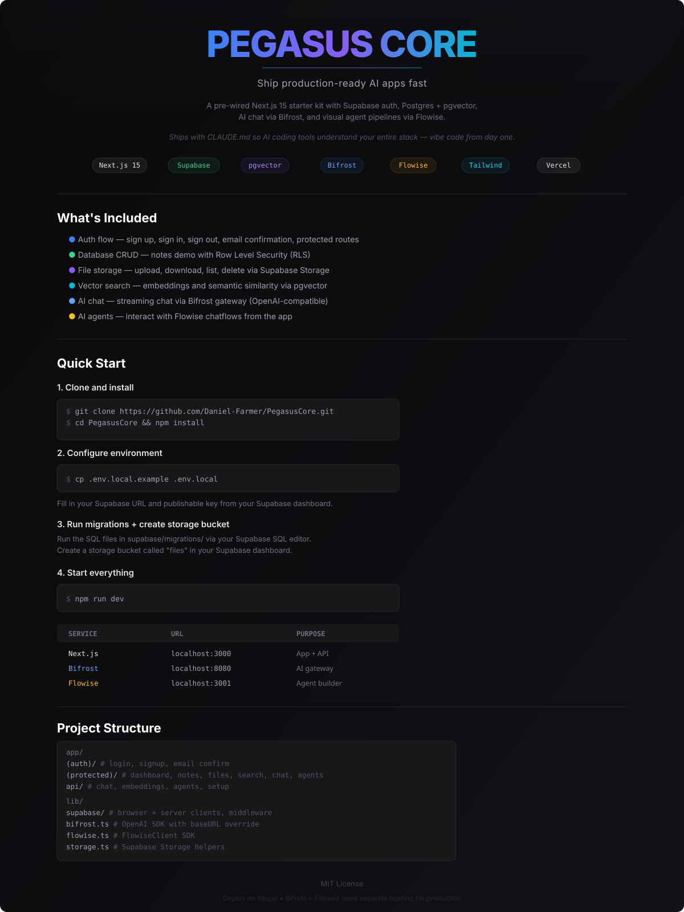

<p align="center">
  
</p>

<p align="center">
  A pre-wired Next.js 15 starter kit with Supabase auth, Postgres + pgvector, AI chat via Bifrost, and visual agent pipelines via Flowise — skip the boilerplate and ship fast.
</p>

<p align="center">
  Ships with CLAUDE.md files so AI coding tools like Claude Code can understand your entire stack — meaning you can vibe code your whole app from day one.
</p>

---

## What's Included

- **Auth flow** — Sign up, sign in, sign out, email confirmation, protected routes
- **Database CRUD** — Notes demo with Row Level Security (RLS)
- **File storage** — Upload, download, list, delete files via Supabase Storage
- **Vector search** — Store embeddings and semantic similarity search via pgvector
- **AI chat** — Streaming chat via Bifrost gateway (OpenAI-compatible)
- **AI agents** — Interact with Flowise chatflows from the app

## Quick Start

### 1. Clone and install

```bash
git clone https://github.com/Daniel-Farmer/PegasusCore.git
cd PegasusCore
npm install
```

### 2. Configure environment

```bash
cp .env.local.example .env.local
```

Fill in your Supabase URL and publishable key from your [Supabase dashboard](https://supabase.com/dashboard).

### 3. Run database migrations

Run the SQL files in `supabase/migrations/` in your Supabase SQL editor (Dashboard > SQL Editor), in order:

1. `00001_create_notes_table.sql` — Notes table with RLS
2. `00002_create_documents_table.sql` — Documents table with pgvector for embeddings

### 4. Create a storage bucket

In your Supabase dashboard, go to Storage and create a bucket called `files`. Enable RLS policies as needed.

### 5. Start services

```bash
npm run dev
```

This starts all three services concurrently:

| Service | URL | Purpose |
|---------|-----|---------|
| **Next.js** | `http://localhost:3000` | App frontend + API |
| **Bifrost** | `http://localhost:8080` | AI gateway (configure providers here) |
| **Flowise** | `http://localhost:3001` | Visual agent builder |

### 6. Open the app

Visit [http://localhost:3000](http://localhost:3000) and follow the setup wizard.

## Project Structure

```
├── app/
│   ├── (auth)/              # Public auth pages (login, signup, email confirm)
│   ├── (protected)/         # Auth-required pages
│   │   ├── dashboard/       # Overview of all integrations
│   │   ├── notes/           # CRUD demo (Supabase DB)
│   │   ├── files/           # File upload demo (Supabase Storage)
│   │   ├── search/          # Semantic search (pgvector)
│   │   ├── chat/            # AI chat (Bifrost streaming)
│   │   └── agents/          # AI agents (Flowise)
│   └── api/                 # API routes (chat, embeddings, agents)
├── lib/
│   ├── supabase/            # Supabase client (browser, server, middleware)
│   ├── bifrost.ts           # Bifrost client (OpenAI SDK with baseURL)
│   ├── flowise.ts           # Flowise client
│   ├── storage.ts           # Supabase Storage helpers
│   └── types/               # TypeScript types
├── components/              # shadcn/ui + shared components
├── middleware.ts             # Auth session refresh
└── supabase/migrations/     # SQL migrations
```

## Deployment

### Vercel

1. Push to GitHub
2. Import project on [Vercel](https://vercel.com/new)
3. Set environment variables in Vercel dashboard
4. Deploy

Bifrost and Flowise need separate hosting (Docker, Railway, etc.) for production.

## Prerequisites

- Node.js 18+
- A [Supabase](https://database.new) project
- (Optional) An AI provider API key (OpenAI, Anthropic, etc.) for Bifrost

## License

MIT
